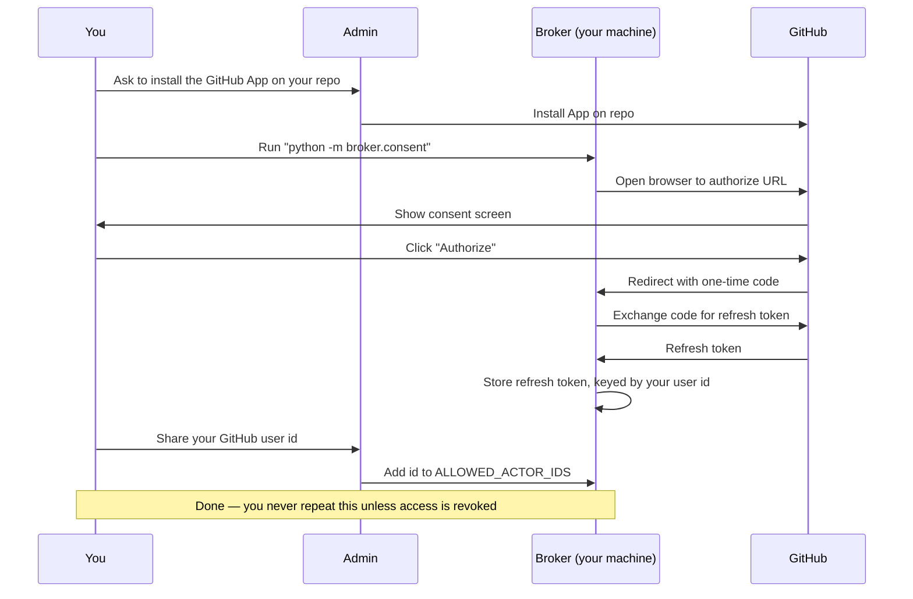
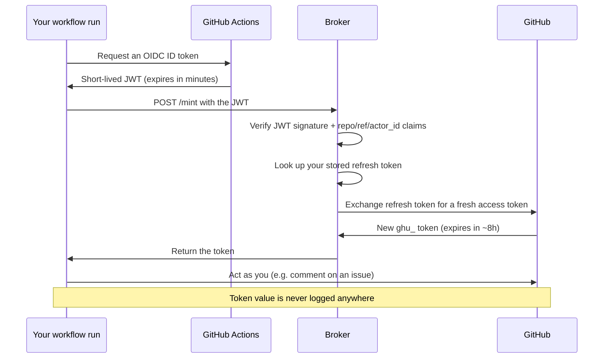
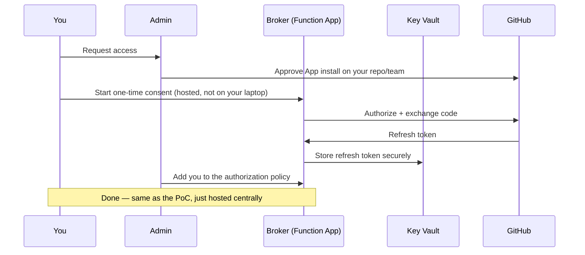
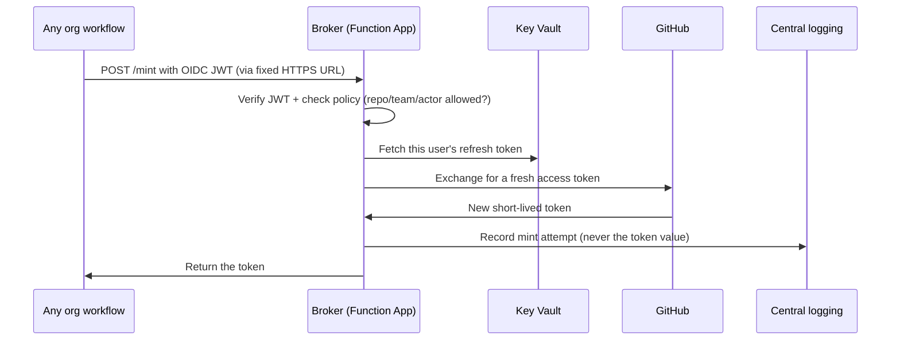

# oidc-broker

A small proof-of-concept that answers one question: **can a GitHub Actions
workflow exchange its built-in OIDC identity for a token that acts as a real
human user** — instead of a bot/service account — **without ever storing a
long-lived credential in the workflow itself?**

Answer: yes. This repo shows exactly how.

## The idea, in plain terms

1. GitHub Actions can mint a short-lived, signed **ID token (JWT)** for any
   workflow run, for free, with no extra setup. It's the same mechanism
   cloud providers use for "OIDC login" instead of storing cloud secrets in
   CI. Nobody but GitHub can forge this token.
2. That JWT proves *"this exact workflow run, on this exact repo/branch,
   really is happening right now"* — but it doesn't grant access to
   anything by itself.
3. We stand up a small **broker** (a tiny local web server) that:
   - Checks the JWT is genuinely signed by GitHub (not forged)
   - Checks it's for *this* repo, *this* branch, and an allow-listed user
   - If everything checks out, hands back a **real GitHub token, scoped to
     a human user** — obtained once via a one-time browser login, then
     silently refreshed each time it's needed
4. The workflow uses that token to act on GitHub *as that person* — e.g.
   post an issue comment that shows up with their name and avatar, not a
   bot's.

```
 GitHub Actions run                    Your machine
┌─────────────────────┐         ┌───────────────────────────┐
│ 1. mint OIDC JWT     │──POST──▶│ 2. broker verifies JWT     │
│    (built-in,free)   │  /mint  │    + returns a user token  │
└─────────────────────┘         └───────────────────────────┘
                                          ▲
                                          │ one-time browser login
                                          │ (Step 2, done once)
                                     you, the human
```

## What's in this repo

| Path | What it does |
|---|---|
| `broker/consent.py` | Run **once**: opens your browser, you click "Authorize", it stores a refresh token for your GitHub user id. |
| `broker/server.py` | The broker itself. Verifies incoming JWTs and mints tokens on request. |
| `broker/config.py` | Reads all settings from `.env`. |
| `broker/token_store.py` | Tiny local file that remembers your refresh token (owner-only file permissions). |
| `.github/workflows/poc-mint.yml` | The workflow step that requests a JWT and calls the broker. Only runs when manually triggered, and refuses to run on `main`. |
| `docs/INITIAL.md` | The original detailed step-by-step plan this was built from. |

## Try it yourself

```bash
python3 -m venv .venv && source .venv/bin/activate
pip install -r requirements.txt
cp .env.example .env   # then fill in the values below
```

Fill in `.env`:
- `GITHUB_APP_ID`, `GITHUB_APP_CLIENT_ID`, `GITHUB_APP_CLIENT_SECRET` — from
  a GitHub App you register yourself (see `docs/INITIAL.md` Step 1)
- `EXPECTED_REPOSITORY` — `owner/repo` of this repo
- `EXPECTED_REF` — the exact branch the workflow will run on
- `ALLOWED_ACTOR_IDS` — your GitHub user id (printed after step 1 below)

**1. One-time login** (do this once, needs a real browser):
```bash
python -m broker.consent
```

**2. Start the broker:**
```bash
python -m broker.server
```

**3. Make it reachable from GitHub's servers** (separate terminal):
```bash
ngrok http 9000
```
Copy the `https://...ngrok...` URL it prints.

**4. Tell the workflow where to find it:**
```bash
gh secret set POC_BROKER_URL --body "https://<your-ngrok-url>"
```

**5. Run it:**
```bash
gh workflow run poc-mint.yml --ref <your-branch>
```

The workflow fetches a token from the broker and prints only its
`expires_in` (never the token itself) as a sanity check.

> **Hint — one App, many repos and users:** a single GitHub App can be
> installed on any number of repos (or org-wide) and authorized by any
> number of users independently. This broker already supports many users
> out of the box (`token_store.py` keys refresh tokens by GitHub user id),
> but only supports **one** repo/ref at a time (`EXPECTED_REPOSITORY`,
> `EXPECTED_REF` are single values in `.env`). Scaling to many repos means
> turning those into an allow-list or policy lookup instead of one fixed
> value — see the enterprise-setup table below.

## User journey

**First-time use** (one person, one time, needs a real browser):



**Every subsequent use** (e.g. a workflow you triggered needs your token —
fully automatic, no browser, no interaction from you):



The key point: the second diagram is **fully automatic** and repeats for
every workflow run, forever — until you revoke the App's authorization. You
only ever go through the "First-time use" flow once per person.

## Moving beyond a PoC: what a simple enterprise setup needs

This repo intentionally cuts corners for a single-user, single-repo demo:
a local Python process, a JSON file for refresh tokens, and a free `ngrok`
tunnel that changes URL on every restart. None of that is appropriate for
real, ongoing use. Here's the minimum you'd need to change:

| PoC shortcut | Enterprise replacement |
|---|---|
| Local `python -m broker.server` on your laptop | Deploy the broker as a real service — e.g. an **Azure Function App** (HTTP trigger) or a small container on App Service / Cloud Run. No laptop dependency, no "it only works while my machine is on". |
| `ngrok` tunnel (ephemeral URL, free-tier warning page) | A stable public HTTPS endpoint — the Function App/App Service URL itself, behind your normal ingress/WAF. No tunnel needed at all once the broker isn't running locally. |
| `.data/refresh_tokens.json` on local disk | A managed secret store: **Azure Key Vault**, AWS Secrets Manager, or a database with encryption at rest. Refresh tokens are long-lived credentials — treat them with the same care as passwords. |
| `GITHUB_APP_CLIENT_SECRET` / `NGROK_AUTHTOKEN` in a local `.env` file | Injected at runtime from the platform's secret store (Key Vault references in App Settings, GitHub Actions OIDC-to-Azure federation, etc.) — never a file on disk. |
| One hardcoded `ALLOWED_ACTOR_IDS` allow-list in `.env` | A real authorization policy: a small database/config mapping GitHub org teams or specific users to what they're allowed to mint, checked and audit-logged on every request. |
| One GitHub App installed by one person, for one repo | The GitHub App installed at the **organization** level, with an approval process for which repos/teams can use it, and someone accountable for its permissions. |
| No logging beyond stdout on your terminal | Structured, centralized logging (e.g. Azure Application Insights) — log every mint attempt (repo, ref, actor, allow/deny, timestamp) **without ever logging the token itself**. |
| No rate limiting | Rate-limit and alert on unusual mint patterns (same actor minting unusually often, requests from unexpected repos, etc.) |
| Manual `gh secret set POC_BROKER_URL` per tunnel restart | Not needed — a real deployed service has a fixed, known URL, set once as a repo/org secret. |

In short: same core idea (verify a GitHub OIDC JWT, exchange a stored
refresh token, return a short-lived user token) — but running as a proper
managed service with real secret storage, logging, and an authorization
policy instead of a hand-edited allow-list.

**The same two journeys, in an enterprise setup** — the flow doesn't
change, only *where things run* and *who's accountable* for each step:





## "Doesn't the App need to be installed on every repo?" — yes, but that's a one-time, org-wide step

A common objection: acting as a user via a GitHub App requires the App to
be **installed** on the target repo(s), and installing an App needs an
org/repo admin — which sounds like it doesn't scale without constant admin
involvement. This is worth untangling, because two separate steps get
conflated:

| Step | Who does it | How often | Result |
|---|---|---|---|
| **Install** the App on a repo/org | An org or repo admin | **Once, org-wide** (`--repository-selection all` or a defined set of repos) | The App is *permitted* to act within those repos at all |
| **Authorize** the App as a user (OAuth consent) | Each developer, for themselves | Once per developer, **no admin needed** | A refresh token bound to that specific user is issued |

Installation and per-user authorization are independent. Once an admin
installs **one** broker App org-wide, every subsequent developer onboarding
is fully self-service (`python -m broker.consent`) — no further admin
ticket per person, and none per repo added later if the App was installed
org-wide. The admin dependency is a single bootstrap action for the whole
org, not a recurring cost per user.

This also means there is no need for "one App per developer" or "one App
per org per developer" — a single App, installed once, can be authorized
independently by any number of users (`broker/token_store.py` already keys
refresh tokens by GitHub user id to support exactly this). Concerns about
GitHub App count limits (e.g. "can we even create 5000+ apps?") don't apply
here — the design only ever needs **one** broker App.

### Compared to a long-lived personal access token in an env variable

An alternative some teams reach for is simpler on paper: each developer
generates a personal access token once and drops it into a CI secret/env
var, with no admin step at all. That's real, and it's a legitimate reason
to prefer it in a pinch — but it trades away everything this broker buys:

| | Static PAT in env | OIDC broker (this repo) |
|---|---|---|
| Admin involvement | None | One-time, org-wide App install |
| Rotation | Manual, easy to forget, often never happens | Automatic — each token lives ~8h, reissued per request from a refresh token |
| Blast radius if leaked | Valid until someone manually revokes it | Expires within hours regardless; scoped to a specific repo/ref/actor at mint time |
| Bound to a specific workflow context | No — works anywhere the token's scope reaches | Yes — verified against the OIDC JWT's `repository`, `ref`, and `actor_id` claims before minting |
| Auditability | Weak — just "a token was used" | Every mint attempt is checkable per workflow run and actor |
| Ongoing developer burden | Must remember to rotate/store the secret themselves | One-time browser consent, invisible afterwards |

The PAT approach is not being invalidated here — it's more scalable in the
sense that it needs zero manual admin action per rollout, and a developer
could hold that credential across several repos in one go depending on its
scope. But it comes at the cost of a long-lived, unrotated, unaudited
credential sitting in plaintext-adjacent CI config. The broker trades a
single, one-time admin bootstrap for automatic rotation, tight scoping, and
auditability going forward.

### What's still genuinely missing for an org-wide rollout

Beyond the enterprise-setup table above, two policy gaps are specific to
scaling past one repo/branch:

1. `EXPECTED_REPOSITORY` / `EXPECTED_REF` in `broker/config.py` are single
   values today — an org rollout needs these to become an allow-list or
   policy lookup (e.g. `org/*` plus an allowed-branch pattern) instead of
   one fixed pair per broker instance.
2. Offboarding: when a developer leaves, their stored refresh token must be
   revoked as part of the standard offboarding process — this needs to be
   a defined step, not an afterthought.

## Why this matters

Normally, giving a CI job the ability to "act as a user" means storing a
long-lived personal access token as a secret — if that secret leaks, it's
valid until manually revoked. Here, nothing long-lived ever touches the
workflow: the JWT is minted fresh per run and expires in minutes, and the
actual user token never leaves the broker except as a short-lived response
used immediately.

## Cleanup

This is a PoC, not a running service. When you're done experimenting:
- Stop the broker and `ngrok` processes
- `gh secret delete POC_BROKER_URL`
- Revoke the GitHub App's authorization: https://github.com/settings/applications
- Delete `.data/refresh_tokens.json`

Full checklist: see `docs/INITIAL.md`.
